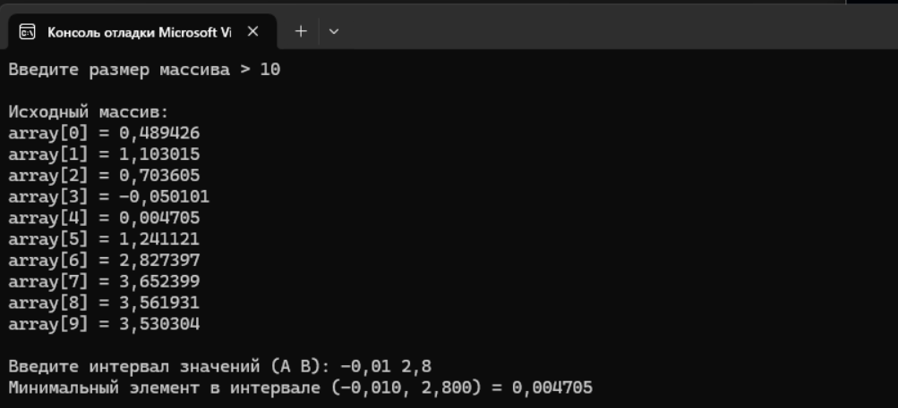

# Домашнее задание к работе 18
## Условие задачи
Вар 7. Поиск минимального значения элемента массива, в заданном интервале значений (A,B).
### Алгоритм
1. Начало.
2. Ввод данных size;
3. Вызывается функция full_elements(array, size).
    -границы интервала: start = 0.1, end = 2.1;
    -вычисляется шаг:step = (end - start) / (size - 1);
    -вычисляется элемент массива: array[i] = x² + sin(5x);
    -массив полностью заполняется вычисленными значениями.
4. Печать массива print_array(array, size)
5. Ввод интервала для поиска
    -Пользователь вводит два числа: A и B.
    -ищутся значения строго между A и B: (A < element < B)
 
6. Поиск минимального значения в интервале
    -Вызывается min_in_range(array, size, A, B).
    -Если ни одного элемента в интервале не нашлось — возвращается NAN
7.Вывод
8.Конец

### Блок-схема

## 2. Реализация программы:
#define _CRT_SECURE_NO_WARNINGS
#define _USE_MATH_DEFINES
#include <locale.h>
#include <stdio.h>
#include <stdlib.h>
#include <string.h> 
#include <conio.h>
#include <math.h>
#include <time.h>
#include <float.h> 
#define N 200
double* full_elements(double* ptr_array, int n) {
    double start = 0.1;
    double end = 2.1;
    if (n == 1) {
        ptr_array[0] = start * start + sin(5 * start);
        return ptr_array;
    }

    double step = (end - start) / (n - 1);

    for (int i = 0; i < n; i++) {
        double x = start + i * step;
        ptr_array[i] = x * x + sin(5 * x);
    }
    return ptr_array;
}
void print_array(double* ptr_array, int n) {
    for (int i = 0; i < n; i++) {
        printf("array[%d] = %.6f\n", i, ptr_array[i]);
    }
}
double min_in_range(double* ptr_array, int n, double A, double B) {
    int found = 0;
    double min_val = 0;
    for (int i = 0; i < n; i++) {
        if (ptr_array[i] > A && ptr_array[i] < B) {
            if (!found) {
                min_val = ptr_array[i];
                found = 1;
            }
            else if (ptr_array[i] < min_val) {
                min_val = ptr_array[i];
            }
        }
    }
    if (!found)
        return NAN;
    return min_val;
}
int main() {
    setlocale(LC_ALL, "RUS");
    double array[N];
    int size;
    printf("Введите размер массива > ");
    scanf("%d", &size);
    full_elements(array, size);
    printf("\nИсходный массив:\n");
    print_array(array, size);
    double A, B;
    printf("\nВведите интервал значений (A B): ");
    scanf("%lf %lf", &A, &B);
    double result = min_in_range(array, size, A, B);
    if (isnan(result))
        printf("Нет элементов массива в интервале (%.3f, %.3f)\n", A, B);
    else
        printf("Минимальный элемент в интервале (%.3f, %.3f) = %.6f\n",
            A, B, result);
    return 0;
}

## 3. Результат работы программы

## 4. Информация о разработчике
Амелина Юлия, бИПТ-252
